# Tarkov Pal

타르코프(Escape from Tarkov) 레이드 도우미입니다. 레이드 중 **PrintScreen 한 번이면 지도에 내 위치가 찍히고**, 게임 위에 **미니맵**이 뜨고, 게임 파일로 만든 **3D 지도**로 가 보지 않은 길을 미리 둘러볼 수 있습니다. 퀘스트 · 아이템 가격 · 탄약표 · 은신처 · 파티 위치 공유 · 각종 타이머까지 한 프로그램에 들어 있습니다.

**Windows 10/11 · 무료 · 설치 없음 · 한국어**

> 게임 메모리를 읽거나 게임에 코드를 넣지 않습니다. 게임이 스스로 남기는 **스크린샷 파일 이름**(좌표가 적혀 있음)과 **로그 파일**, 그리고 설치된 **게임 파일**(3D 지도를 만들 때)만 읽습니다.

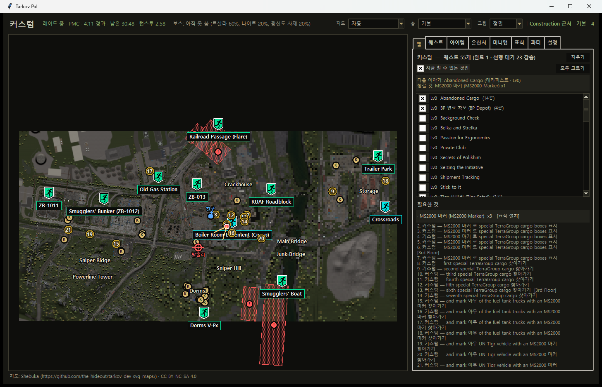

## 받기

1. [최신 버전 받기 (Releases)](../../releases/latest) 에서 `TarkovPal_한벌.zip` 을 받습니다.
2. 압축을 풀면 `TarkovPal` 폴더 하나가 나옵니다. 안의 `TarkovPal.exe` 를 실행하세요.
   - exe 만 따로 꺼내면 켜지지 않습니다. **폴더째로** 두세요.
   - 처음 켤 때 "Windows의 PC 보호" 창이 뜨면 `추가 정보` → `실행` 을 누르세요.
3. 지도 · 퀘스트 · 가격 자료가 모두 들어 있어서 **인터넷이 없어도** 열립니다. 설정과 진행도도 폴더 안 `TarkovPal_자료` 에 저장되니, 폴더째 옮기면 다른 PC 에서도 그대로 이어서 쓸 수 있습니다.

게임 폴더(로그 · 스크린샷)는 알아서 찾습니다. 못 찾을 때만 설정에서 직접 고르면 됩니다.

## 할 수 있는 것

### 내 위치 — PrintScreen 한 번

- 레이드 중 `PrintScreen` 을 누르면 그 자리가 큰 지도에 점과 **바라보는 방향** 화살표로 찍힙니다. 찍힌 PNG 는 좌표를 읽은 뒤 바로 지웁니다(끌 수 있음).
- **13개 맵 전부**: 커스텀 · 팩토리 · 우즈 · 쇼어라인 · 인터체인지 · 리저브 · 더 랩 · 라이트하우스 · 스트리트 · 그라운드 제로 · 래버린스 · 터미널 · 아이스브레이커.
- **56개 층 자동 전환** — 내 높이를 보고 그 층 지도로 바뀝니다(리저브 지하, 랩, 아이스브레이커 갑판 등).
- 어느 맵을 불러왔는지, PMC 인지 스캐브인지 로그로 알아서 잡습니다. 맵을 고를 필요가 없습니다.
- 지도는 **정밀**(위성 사진 타일) · **간단**(도면) · **입체**(3D) 세 가지로 볼 수 있습니다.

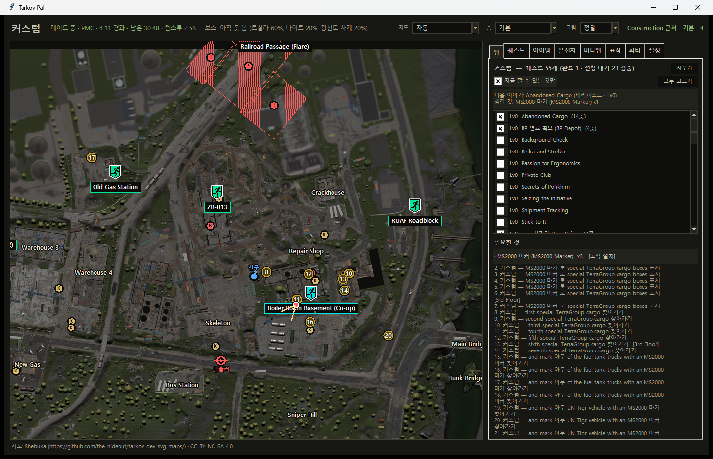

### 입체(3D) 지도 — 게임 파일로 직접 만든

이 PC 에 깔린 게임 파일을 그 자리에서 읽어 3D 지도를 만듭니다. 게임 파일은 배포 파일에 들어 있지 않습니다.

- 건물 · 지형 · 나무 · 물이 **게임 속 자리 그대로** 서 있고, 벽돌 · 아스팔트 · 전차 선로 · 풀 같은 **게임 텍스처**를 입혀서 "여기가 어디인지" 한눈에 알아볼 수 있습니다.
- **전체 보기**: 끌어서 돌리고, Shift+끌기로 옮기고, 휠로 확대합니다. 지명 · 탈출구 · 퀘스트 번호 · 핑 · 파티원이 같이 뜹니다.
- **둘러보기**: W A S D 로 걸어 다니고, Shift 로 달리고, 오른쪽 클릭으로 마우스 시점. 숲 · 해안선 · 등대는 게임 높이맵 위를 걷습니다.
- 가벼움: 둘러보는 동안 CPU 한 코어의 11~16 %, 한 판(프레임) 1~3 ms.

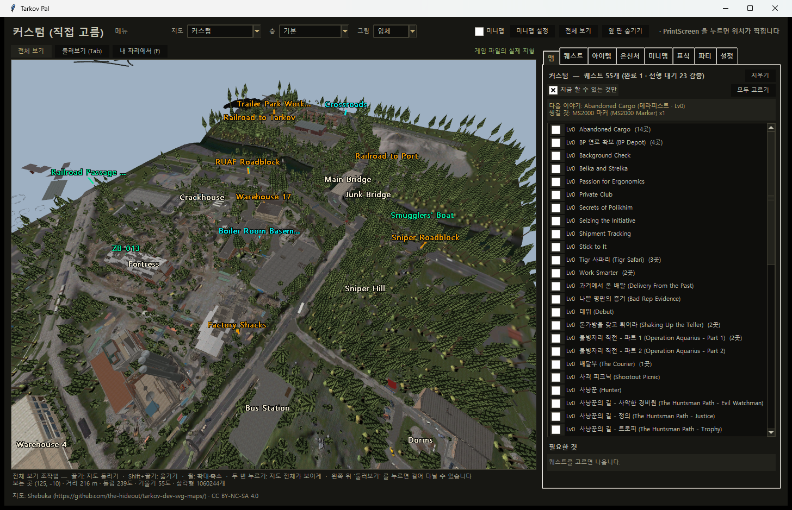

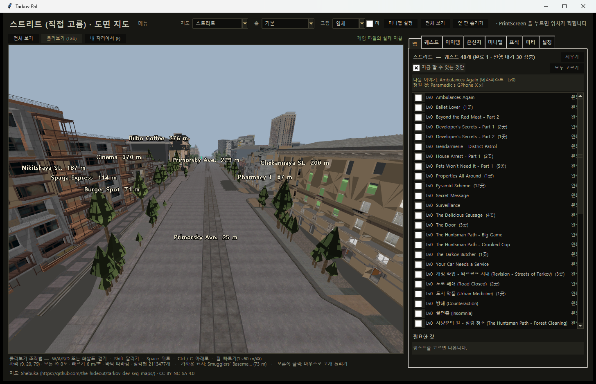

| | |
|---|---|
| 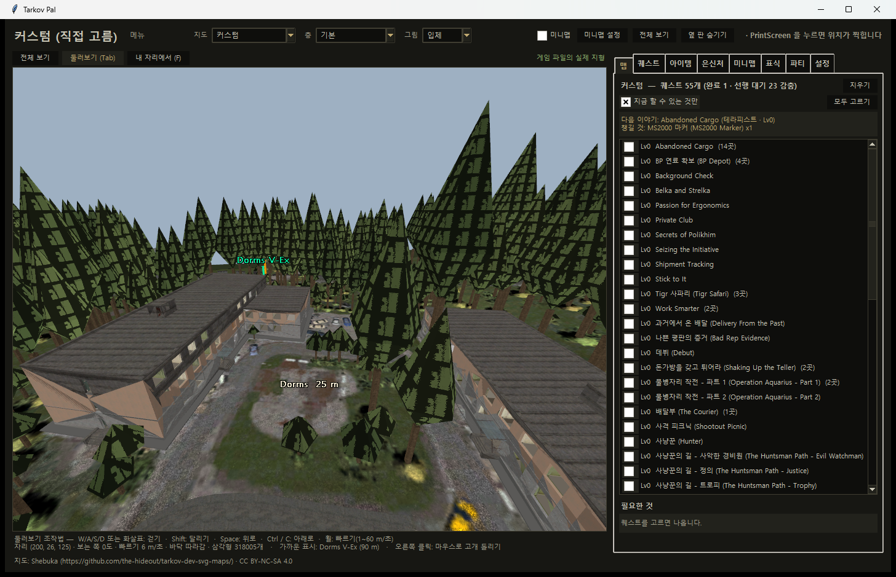 | 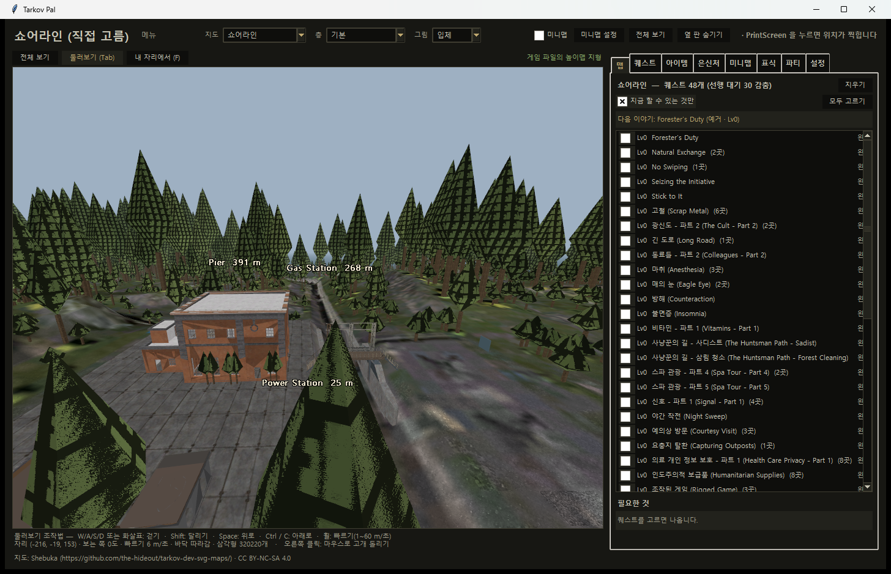 |

### 입체 미리 만들기 — 누르자마자 뜨게

맵마다 처음 3D 를 열 때는 게임 파일을 읽느라 10초~1분 걸립니다. **설정 → 입체 미리 만들기** 에서 한 번 만들어 두면 그다음부터는 1~2초 만에 뜹니다.

- `전부 미리 만들기` 한 번이면 13개 맵에 10분 안팎. 뒤에서 가장 낮은 우선순위로 만들어서 창이 굼뜨지 않고, **레이드 중에는 쉬었다가** 끝나면 이어서 합니다.
- `안 된 맵은 알아서 만들기` 를 켜 두면 게임이 꺼져 있을 때 알아서 채웁니다.
- 게임이나 지도 자료가 바뀌면 목록에 `아직` 으로 표시되고 다시 만들 수 있습니다.

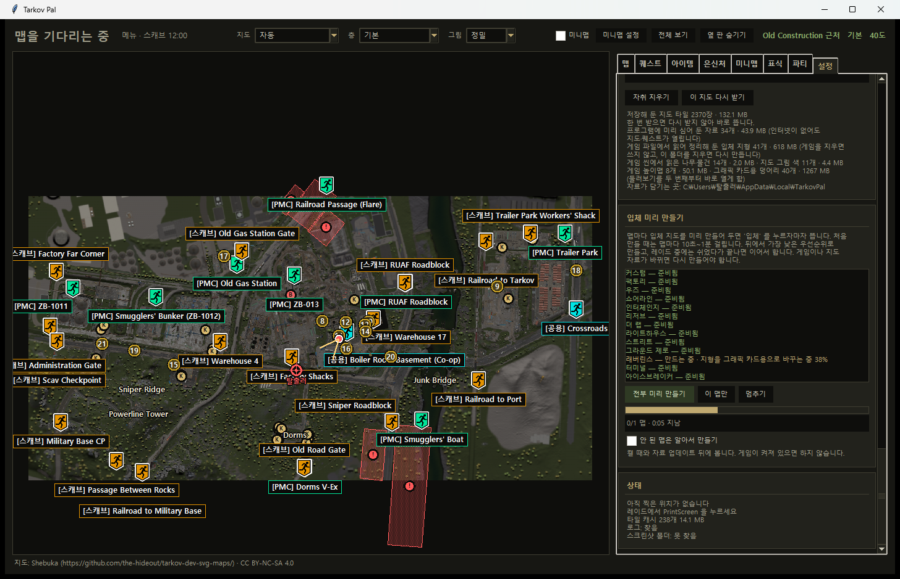

### 게임 위 미니맵

- 게임 창 위에 늘 떠 있는 작은 지도. **클릭이 통과**하고 투명도 · 크기 · 위치를 고를 수 있습니다.
- `내 주변만` (1~20배) 또는 맵 전체. `레이드 중에만 띄우기` 를 켜면 메뉴에서는 사라졌다가 레이드가 시작되면 다시 뜹니다.
- 퀘스트 지점 · 탈출구 · 파티원 · 핑 · 경로가 같이 나오고, 항목마다 켜고 끌 수 있습니다.

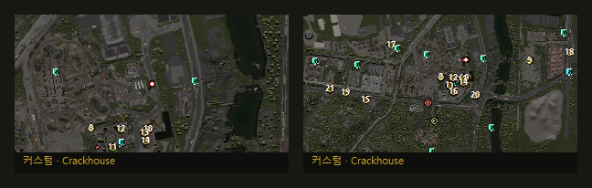

### 퀘스트

- 지금 맵에 걸린 퀘스트만 **한글 (영문)** 으로 보여 주고, 체크하면 지도에 번호가 찍힙니다. 다른 층 지점은 흐리게.
- **게임 로그를 읽어 끝낸 퀘스트는 알아서 빠집니다.** 선행 조건이 안 된 퀘스트는 따로 셉니다.
- 상인별로 "여기까지 했다" 를 한 번 고르면 앞 퀘스트가 전부 완료로 잡힙니다(515개 퀘스트를 11번 클릭으로).
- TarkovTracker 토큰으로 기록 가져오기. PVE 와 PVP 는 따로 셉니다.
- 필요 아이템: 고른 퀘스트에 드는 아이템을 합쳐 보여 주고, 모은 개수를 적으면 남은 수가 바로 바뀝니다(레이드 획득 표시).

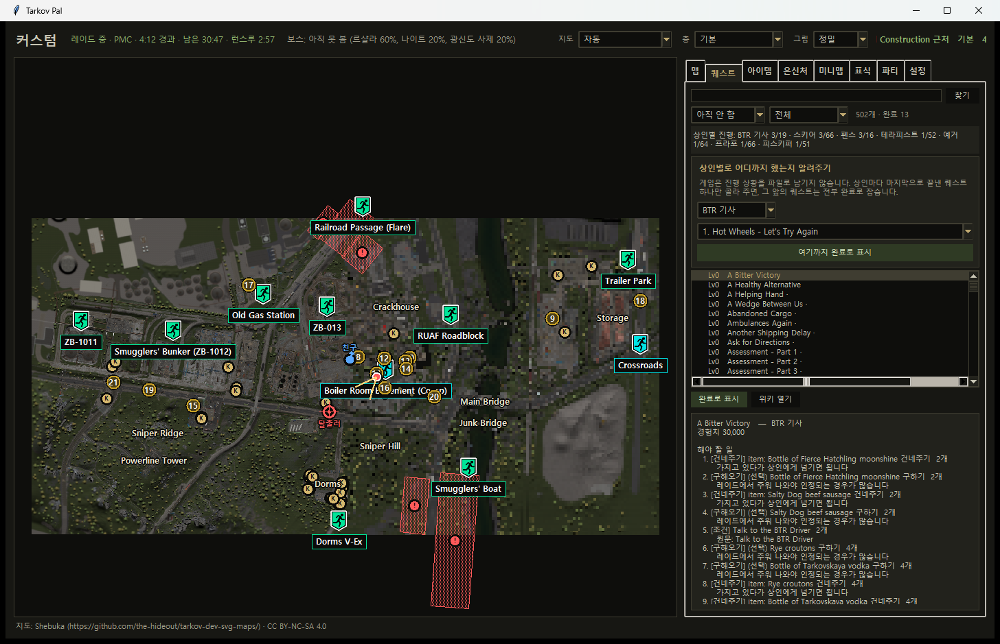

### 지도 정보 (tarkov.dev)

- 켜고 끄는 레이어 12종: 보스 등장 구역과 확률 · 경호 인원 · 체력, PMC / 스캐브 / 저격수 스폰, 열쇠가 필요한 문, 지뢰밭 · 저격수 구역(실제 범위), 스위치, 거치 무기, BTR 정류장, 다른 맵 이동 지점, 컨테이너.
- `이 맵에서 찾기`: 아이템 · 보스 · 열쇠 · 컨테이너 이름을 치면 그 자리로 확대.
- 탈출구는 PMC / 스캐브 / 공용 색으로 나누고, 레이드가 시작되면 내 진영 것만 남깁니다.
- 배틀패스 문서 스폰 자리 308곳(12맵), 누르면 설명과 위치 사진.

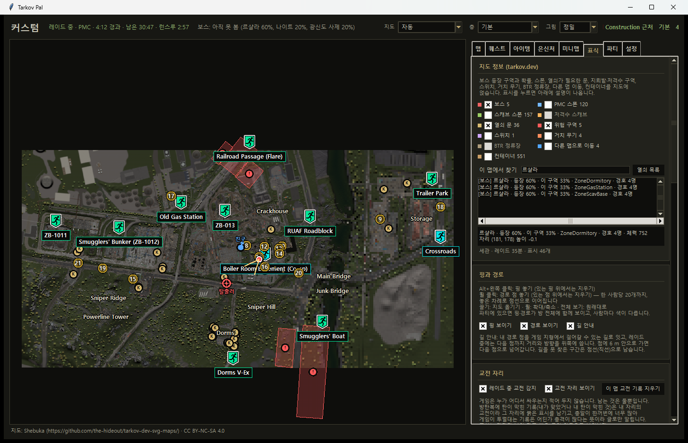

### 가격 · 탄약

- 4,835개 아이템: 플리마켓 평균 · 최저 · 최고 · 48시간 변동 · 매물 수, 상인 최고 판매가 · 최저 구매가, **수수료 뺀 가장 남는 곳**, 칸당 값. 버튼 하나로 갱신.
- 탄약표 31개 구경: 관통 등급 색, 피해 · 방어구 손상 · 파편 · 탄속 · 정확도 · 반동 · 상인 가격.

| | |
|---|---|
| 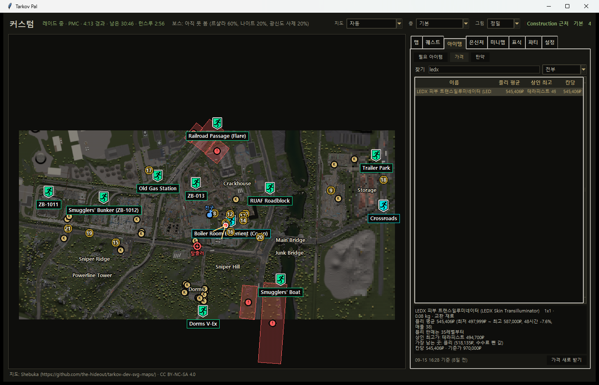 | 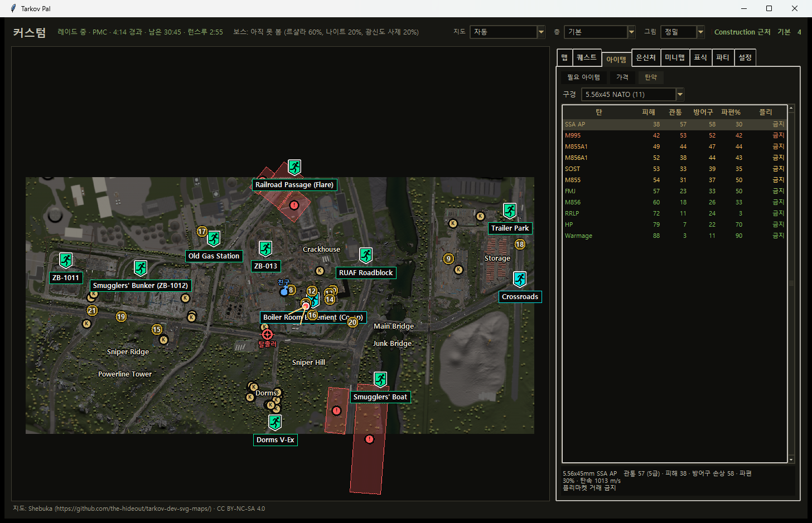 |

### 은신처

- 제작 타이머: 무엇을 돌렸는지 적어 두면 끝나는 시각을 셉니다.
- 업그레이드 재료 관리: 구역 26개, 지금 단계만 맞춰 두면 다음 단계 재료 · 모은 개수 · 남은 수가 나오고 다른 구역 조건은 알아서 판정. `전체 장보기` 로 모든 구역의 다음 단계 재료를 한 번에.

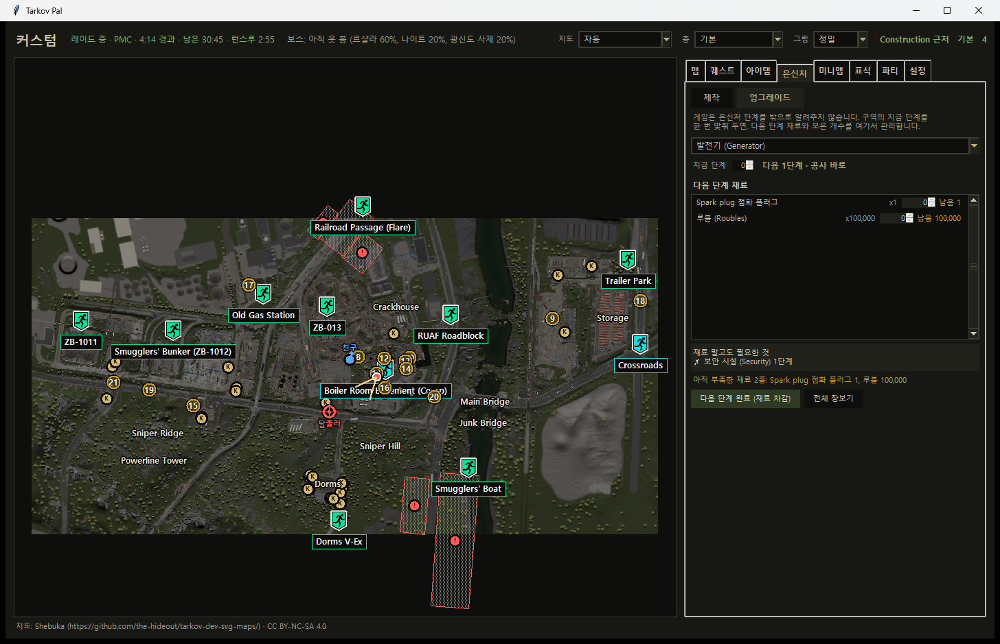

### 파티 — 같이 도는 사람과 위치 공유

- 친구도 이 프로그램을 켜고 한 방에 들어오면 **누가 스크린샷을 찍든 그 자리가 서로의 지도에** 뜹니다. 사람마다 색이 다릅니다.
- `방 만들기` → 초대 코드 하나 → 친구는 붙여 넣고 `들어가기`. 같은 집 · PC방이면 `근처 방 찾기`.
- **공유기 설정이 필요 없습니다.** 직접 연결(UPnP · NAT-PMP 자동)과 중계 서버를 동시에 시도해 먼저 되는 쪽을 씁니다.
- 초대 코드 속 주소는 암호로 잠겨 있어 코드가 새도 IP 를 알 수 없습니다. 암호를 5번 틀리면 1분 차단, 중계로 오가는 내용은 끝-끝 암호화.
- `Alt + 클릭` 핑, `휠 클릭` 경로 점을 파티 전체에 실시간으로 공유.
- **게임 안에서 핑**: 핑 키(기본 숫자패드 9)를 누르고 스크린샷을 찍으면 보고 있는 문 · 컨테이너 · 탈출구 · 퀘스트 지점 · 벽에 핑이 놓이고 무엇인지 글이 붙습니다.

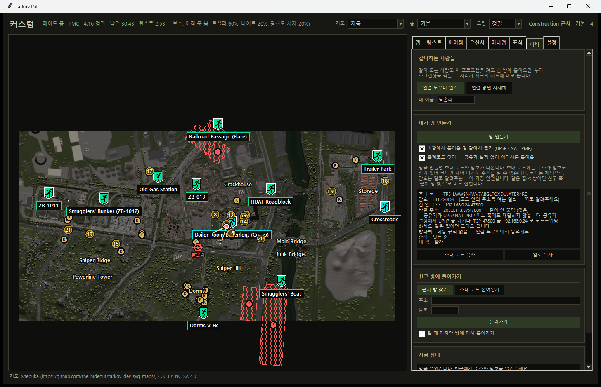

### 시계와 타이머

**설정 → 시계와 타이머** 카드와 위 상태 줄에서 봅니다.

- **타르코프 게임 시각**: 레이드를 고르는 화면의 두 시각(왼쪽 · 오른쪽)과 낮/밤.
- **스캐브 쿨타임**: 펜스 평판과 정보 센터 단계를 넣어 두면, 스캐브 레이드가 끝날 때 알아서 세고 준비되면 소리로 알립니다. 껐다 켜도 이어집니다.
- **런스루**: PMC 레이드 중 상태 줄에 남은 시간이 나오고, 기준(기본 7분 10초)이 지나면 알립니다.
- **상인 재입고**: 9명의 재입고까지 남은 시간(PVP / PVE 따로).
- **맵을 불러올 때 챙길 것**: 이 맵 퀘스트에 들고 들어가야 하는 아이템(MS2000 마커 등)과 고른 퀘스트의 열쇠를 이름까지 알려 줍니다. 매칭 전에 떠서 다시 챙기러 갈 수 있습니다.
- **퀘스트 실패 알림**: 다시 받아야 하는 퀘스트를 알려 줍니다.
- **매칭되면 작업 표시줄의 타르코프가 깜빡**: 다른 창을 보며 기다려도 놓치지 않습니다(게임 창을 앞으로 끌어오지는 않음).
- 레이드 타이머(경과 · 남은 시간), 매칭 완료 · 레이드 시작/끝 · 플리마켓 판매 알림음. 게임 위에서도 들립니다.

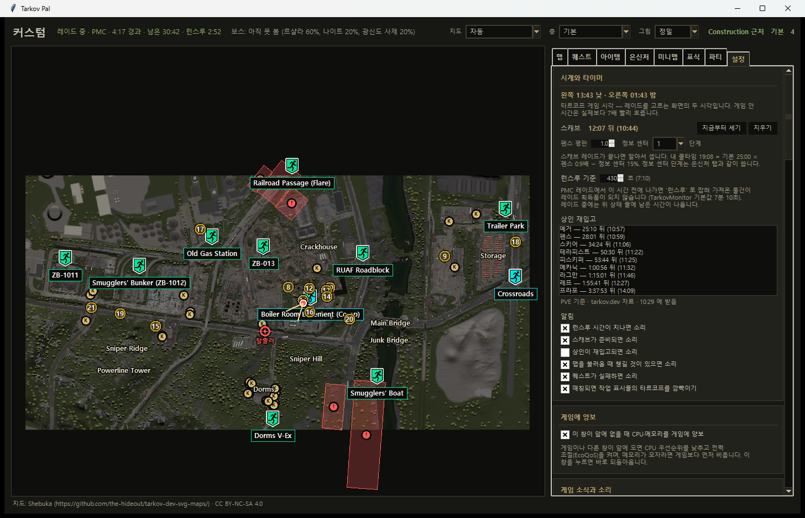

### 멀리 있는 것 두 번 겨눠 찾기

보급품(에어드랍) · 연기 · 저격 자리처럼 멀리 보이는 것의 자리를 찾습니다. **표식 → 두 번 겨누기 시작** 을 누르고, 게임에서 그것을 화면 가운데에 두고 스크린샷 → 옆으로 30 m 이상 옮겨 다시 겨누고 스크린샷. 두 시선이 만나는 곳에 핑이 놓이고 오차(보통 ±수 m)도 알려 줍니다.

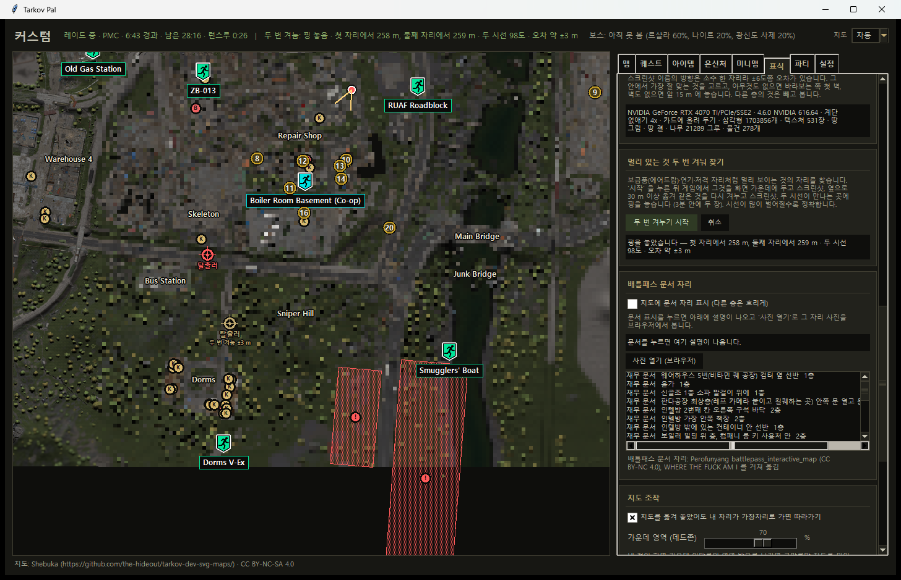

### 그 밖에

- 최근 접속한 서버 목록과 지역(도시 · 통신사는 눌러서 조회).
- 게임 창에서 `Ctrl + 숫자패드`: 0~5 층, `+` / `-` 확대 · 축소, `*` 전체 보기, `.` 옆 판 숨기기. `F11` 전체 화면.
- 글자 · 아이콘 크기, 옆 판 너비, 어두운 / 밝은 테마.
- **게임에 양보**: 이 창이 앞에 없으면 CPU 우선순위와 전력 사용을 낮춰 게임을 방해하지 않습니다.
- `자료 업데이트` 한 번으로 지도 · 퀘스트 · 가격 등 자료를 새로 받습니다.

## 안전에 대해

- 게임 메모리를 읽지 않고, 게임에 아무것도 끼워 넣지 않습니다. 읽는 것은 스크린샷 파일 이름 · 로그 · 설치된 게임 파일(3D)뿐입니다.
- 게임에 키 입력을 보내는 기능은 `자동 촬영`(스크린샷 키를 대신 누름) 하나뿐이고, **기본으로 꺼져 있으며** 위험 안내에 동의해야만 켜집니다. PrintScreen 을 직접 누르면 아무 위험이 없습니다.
- 인터넷은 자료 · 가격 · 재입고 시각 받기와 파티 연결에만 씁니다. 계정 정보나 스크린샷 자체는 어디에도 보내지 않습니다.

## 윈도우 디펜더가 막는다면

파이썬으로 만든 프로그램은 가끔 백신이 기계 학습 추정(`...!ml`)으로 잘못 잡습니다. 이 프로그램은 오탐을 줄이려고 한 파일 exe 대신 **폴더판**으로 배포하고, 두 번째 프로세스를 띄우지 않도록 만들었습니다(3D 를 13개 맵 모두 미리 만드는 동안 디펜더 탐지 없음을 확인). 그래도 잡힌다면 오탐이니 [Microsoft 에 오탐 신고](https://www.microsoft.com/en-us/wdsi/filesubmission)를 해 주시거나, 아래처럼 소스에서 직접 빌드해서 쓰셔도 됩니다.

## 사양

- Windows 10/11 64비트. 압축 61 MB, 풀면 약 90 MB.
- 3D 지도는 게임이 깔린 PC 에서 됩니다. 그래픽 카드가 셰이더 · 텍스처 압축을 못 하면 텍스처 없이 색으로만 그립니다. 게임이 없는 PC 에서도 2D 지도 · 퀘스트 · 가격 등은 모두 됩니다.

## 직접 빌드하기

Python 3.14 로 만들었고, 프로그램 자체는 표준 라이브러리(tkinter · ctypes · OpenGL 직접 호출)만 씁니다.

```bash
pip install pyinstaller
python build.py
```

`dist/TarkovPal/`(폴더판 exe)와 `dist/TarkovPal_한벌.zip` 이 만들어집니다. 소스에서 바로 켜려면 `python tarkov_pal.py`.

시험:

```bash
python -m unittest discover -s tests
```

## 자료 출처 · 고마운 프로젝트

- 지도 타일 · 퀘스트 · 보스 · 스폰 · 열쇠 · 가격 · 상인 재입고: [tarkov.dev](https://tarkov.dev) (the-hideout)
- 도면 지도: Shebuka, [tarkov-dev-svg-maps](https://github.com/the-hideout/tarkov-dev-svg-maps) (CC BY-NC-SA 4.0)
- 한글 이름 · 퀘스트 조건 · 은신처 자료: SPT 로케일
- 퀘스트 진행 연동: [TarkovTracker](https://tarkovtracker.org)
- 배틀패스 문서 자리: Perofunyang battlepass_interactive_map (CC BY-NC 4.0)
- 기능을 참고한 도구 — 코드를 가져오지 않고 이 프로그램 방식으로 새로 만들었습니다:
  [karpitony/eft-where-am-i](https://github.com/karpitony/eft-where-am-i),
  [the-hideout/TarkovMonitor](https://github.com/the-hideout/TarkovMonitor),
  [RatScanner/RatScanner](https://github.com/RatScanner/RatScanner),
  [adamburgess/tarkov-time](https://github.com/adamburgess/tarkov-time),
  [hymccord/ReadySetTarkov](https://github.com/hymccord/ReadySetTarkov),
  [Re5pawnn/Tarkov_ToolBox](https://github.com/Re5pawnn/Tarkov_ToolBox)

지도 그림과 문서 자리 자료가 비영리(CC BY-NC) 조건이라 이 프로그램도 **무료로만** 배포합니다.

## 알림

Escape from Tarkov 는 Battlestate Games Limited 의 상표입니다. 이 프로젝트는 Battlestate Games 와 관계없는 팬 제작 도구이며, 사용에 따른 책임은 사용자에게 있습니다.

---

### English summary

Tarkov Pal is a free, Korean-language companion app for Escape from Tarkov on Windows. Press PrintScreen in raid and your position (with facing) appears on the map — it only reads the coordinates the game writes into screenshot file names and the game's own log files; no memory reading, no injection. It also offers an in-game overlay minimap, a 3D map built on the fly from your installed game files (with game textures, pre-buildable for instant loading), quest tracking from game logs, flea/trader prices, ammo charts, hideout planning, party position sharing, scav cooldown / runthrough / trader restock timers, and two-sighting triangulation for airdrops.
