# Tarkov Pal

타르코프(Escape from Tarkov) 레이드 도우미입니다. 레이드 중 **PrintScreen 한 번이면 지도에 내 위치가 찍히고**, 게임 위에 **미니맵**이 뜨고, **내 PC 에 깔린 게임 파일로 직접 그린 지도**(정밀 지도 · 3D)로 가 보지 않은 길을 미리 둘러볼 수 있습니다. 지뢰밭 · 저격수 구역 · 크레모아, 길 안내, 게임 화면 위 핑, 퀘스트 · 가격 · 교환 · 은신처 · 파티 위치 공유 · 각종 타이머까지 한 프로그램에 들어 있습니다.

**Windows 10/11 · 무료 · 설치 없음 · 한국어**

> 게임 메모리를 읽거나 게임에 코드를 넣지 않습니다. 게임이 스스로 남기는 **스크린샷 파일 이름**(좌표가 적혀 있음)과 **로그 파일**, 그리고 설치된 **게임 파일**(지도 · 3D 를 그릴 때)만 읽습니다.

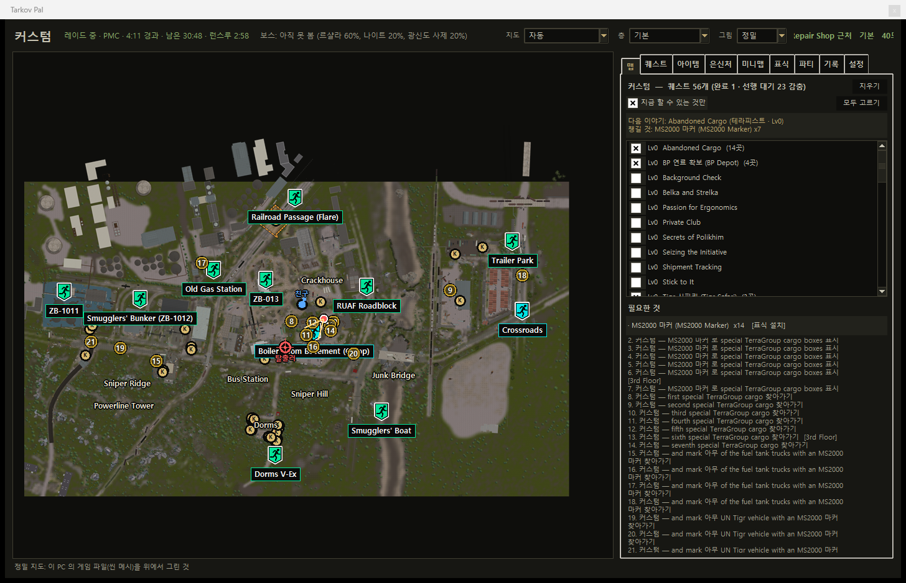

## 무엇이 새로워졌나 (2026-09-28)

- **정밀 지도 = 게임 파일로 직접 그린 지도** — 13개 맵의 모든 층. tarkov.dev 에 없던 스트리트 · 라이트하우스 · 터미널 정밀 지도도 이제 나옵니다.
- **처음 준비 창** — 처음 켤 때 지도 · 3D · 길 안내 · 위험 구역을 만들며 진행 막대와 지금 만드는 맵 · 층을 실시간으로 보여 줍니다.
- **지뢰밭 · 저격수 구역 · 크레모아를 게임 씬에서 그대로** — 네모가 아니라 실제 모양, 갈 수 없는 경계 밖은 잘라서. 라이트하우스 크레모아 91개.
- **배틀패스 문서 자리 375곳(12맵, 쇄빙선 포함)** 을 게임 지도에 다시 맞춤.
- **길 안내**(게임 AI 가 걷는 길) · **게임 화면 위 핑** · **스마트 핑** · **3D 게임 조명 · 밤** · **PVE 로그**(보스 스폰 시도 · 보급품) · **교환 · 제작** · **기록 탭**(보험 · 레이드 기록 · 서버 상태) · **F1 로 게임 위에 띄우기**.

## 받기

1. [최신 버전 받기 (Releases)](../../releases/latest) 에서 `TarkovPal_pak.zip` 을 받습니다.
2. 압축을 풀면 `TarkovPal` 폴더 하나가 나옵니다. 안의 `TarkovPal.exe` 를 실행하세요.
   - exe 만 따로 꺼내면 켜지지 않습니다. **폴더째로** 두세요.
   - 처음 켤 때 "Windows의 PC 보호" 창이 뜨면 `추가 정보` → `실행` 을 누르세요.
3. 처음 켜면 **사용 위험 안내**에 동의한 뒤 **처음 준비 창**이 떠서 13개 맵의 지도 · 3D 를 이 PC 의 게임 파일로 만듭니다(PC 에 따라 10~20분, 한 번만). 다 되면 프로그램이 켜지고, 다음부터는 바로 켜집니다. 도중에 닫아도 다음에 이어서 합니다.
4. 지도 · 퀘스트 · 가격 자료가 들어 있어 **인터넷이 없어도** 열립니다. 설정과 진행도는 폴더 안 `TarkovPal_자료` 에 저장되니 폴더째 옮기면 다른 PC 에서도 이어서 씁니다.

게임 폴더(로그 · 스크린샷 · 게임 파일)는 알아서 찾습니다. 못 찾을 때만 설정에서 직접 고르면 됩니다. 게임이 없는 PC 에서는 준비 창 없이 바로 켜지고 tarkov.dev 지도를 씁니다.

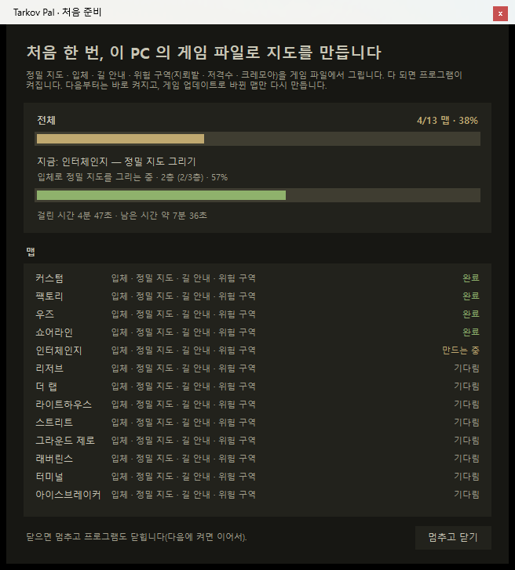

## 할 수 있는 것

### 내 위치 — PrintScreen 한 번

- 레이드 중 `PrintScreen` 을 누르면 그 자리가 지도에 점과 **바라보는 방향** 화살표로 찍힙니다. 찍힌 PNG 는 좌표를 읽은 뒤 바로 지웁니다(끌 수 있음).
- **13개 맵 전부**: 커스텀 · 팩토리 · 우즈 · 쇼어라인 · 인터체인지 · 리저브 · 더 랩 · 라이트하우스 · 스트리트 · 그라운드 제로 · 래버린스 · 터미널 · 아이스브레이커.
- **층 자동 전환** — 내 높이를 보고 그 층 지도로 바뀝니다(리저브 지하, 랩, 아이스브레이커 갑판 등).
- 어느 맵을 불러왔는지, PMC 인지 스캐브인지 로그로 알아서 잡습니다. 맵을 고를 필요가 없습니다.
- 지도는 **정밀**(게임 파일로 그린 지도) · **간단**(평면도) · **입체**(3D) 세 가지.

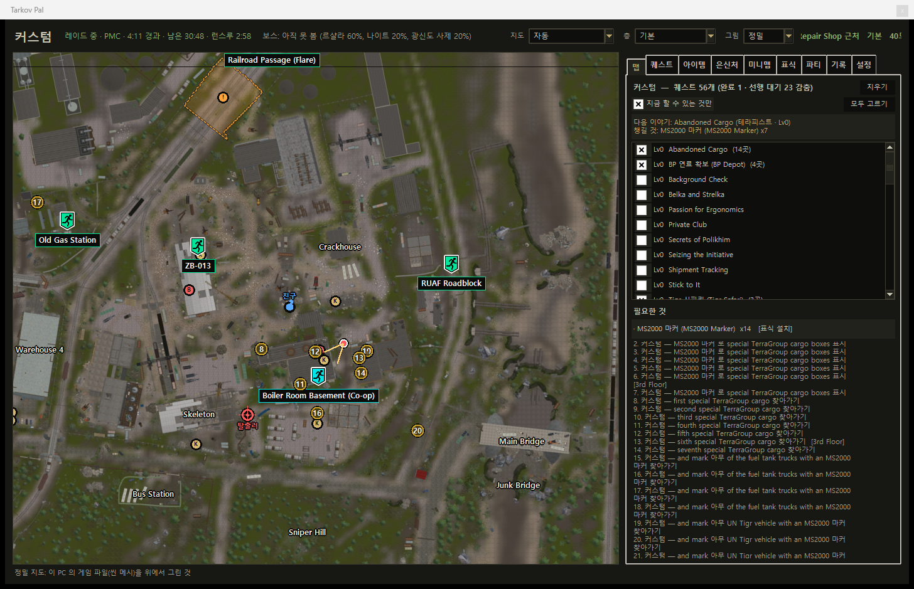

### 정밀 지도 — 게임 파일로 직접 그린 지도

**13개 맵의 모든 층**을 이 PC 의 게임 파일로 만든 3D 를 곧장 위에서 내려다보고 그립니다. 게임 속 물건 · 건물 · 지형이 제자리에 그대로 있습니다.

- tarkov.dev 에 위성 지도가 없거나 오래된 맵(스트리트 · 라이트하우스 · 터미널 · 인터체인지 · 쇼어라인 윗층)도 진짜 정밀 지도로 나옵니다.
- 윗층 · 지하층은 그 층 바닥 높이를 재어 **천장을 걷어 낸 평면**으로, 연구소 · 공장 · 래버린스 · 쇄빙선은 층마다 잘라 그립니다.
- tarkov.dev 위성 지도가 있는 커스텀을 같은 방식으로 그려 겹쳐 보면 어긋남 0화소 — 내 위치 · 핑 · 탈출구가 그대로 맞습니다.
- **간단 지도**: 한눈에 보기 쉬운 평면도(게임 AI 가 걷는 바닥 + 건물). 게임이 업데이트되어 씬이 바뀐 맵만 다시 그립니다.

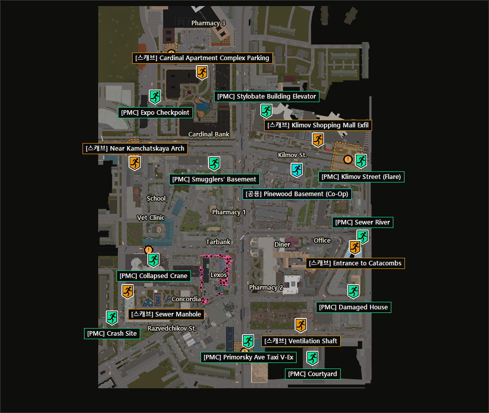

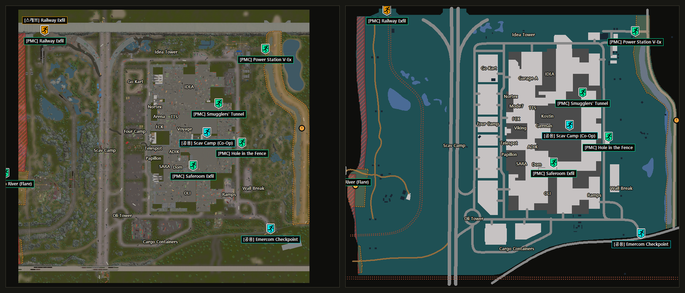

### 지뢰밭 · 저격수 구역 · 크레모아 — 게임 씬에서 그대로

- 게임 씬 파일에서 **실제 발동 범위**를 읽습니다. 겹친 구역은 한 덩어리로 합치고, 반투명 · 부드러운 테두리로 그립니다. 지뢰밭 = 빗금, 저격수 = 점선 테두리, 크레모아 = 부채꼴 범위 + 지뢰 자리 · 방향, 함정 = 격자 빗금.
- **플레이어가 갈 수 없는 맵 경계 밖은 잘라서** 보여 줍니다.
- 라이트하우스: 지뢰밭 5곳, 저격수 구역 2곳, **크레모아 91개**(섬으로 가는 다리 · 섬 입구). 스트리트 크레모아 43개, 래버린스 함정 17곳(불 · 액체 · 증기 · 가시).
- 정밀 · 간단 지도 · 미니맵 모두 같은 모양. 지뢰밭 · 저격수 구역 20 m, 크레모아 8 m 앞부터 경고.

| | |
|---|---|
| 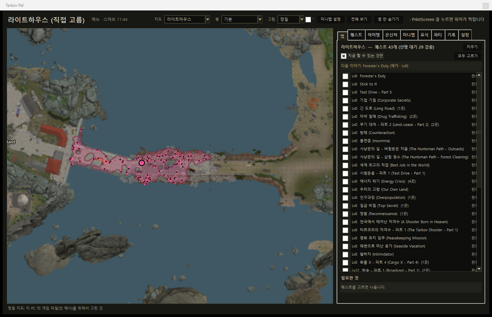 | 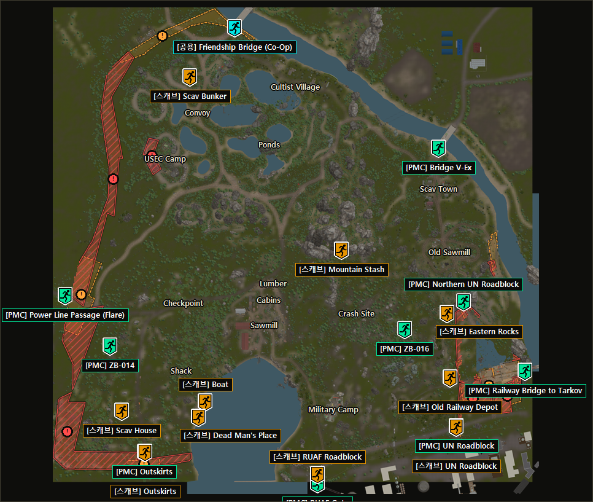 |

### 길 안내 — 게임 AI 가 걷는 길로

- 지도에 `휠 클릭` 으로 경로 점을 찍으면, 게임의 **내비메시**(AI 가 걷는 길)를 따라 실제로 걸어갈 수 있는 길을 그려 줍니다. 직선이 아니라 담 · 건물을 돌아갑니다.
- 파티원에게도 같이 보입니다.

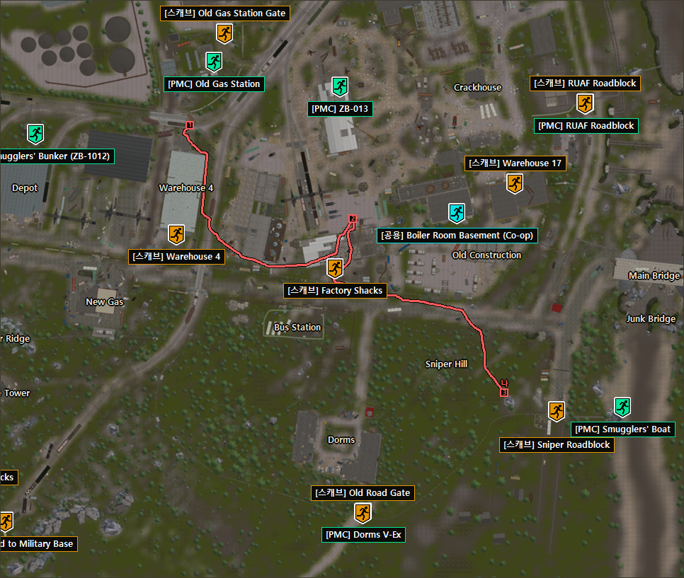

### 입체(3D) 지도 — 게임 파일로 직접 만든

- 게임 씬의 렌더 메시를 **전부** 읽어 건물 · 지형 · 나무 · 물 · 물건이 게임 속 자리 그대로 서 있고, 게임 텍스처를 입혔습니다.
- **게임 조명**: 가로등 · 실내등을 게임 파일에 적힌 세기 그대로 켜고, 하늘과 해는 **레이드의 게임 시각**을 따라갑니다(밤 레이드는 밤으로).
- **전체 보기**: 끌어서 돌리고, Shift+끌기로 옮기고, 휠로 확대. **둘러보기**: W A S D 로 걷고 Shift 로 달리고, 오른쪽 클릭으로 마우스 시점. 지명 · 탈출구 · 퀘스트 번호 · 핑 · 파티원이 같이 뜹니다.

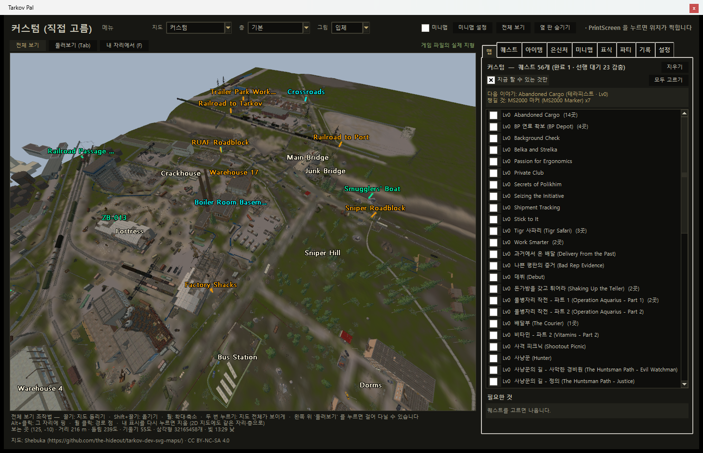

| | |
|---|---|
| 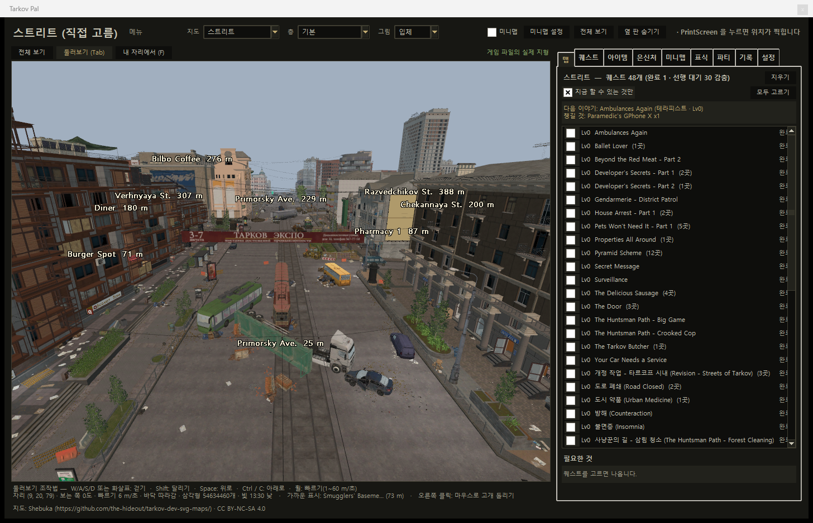 | 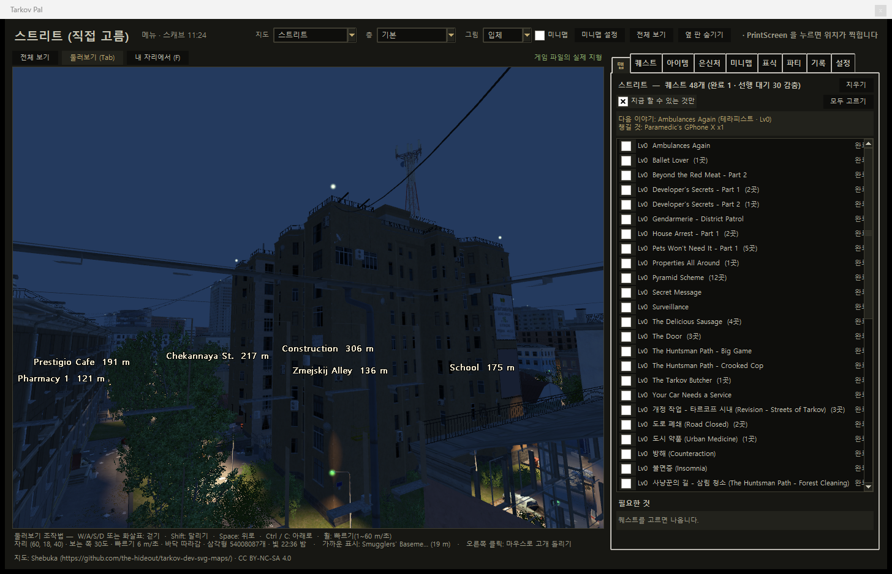 |
| 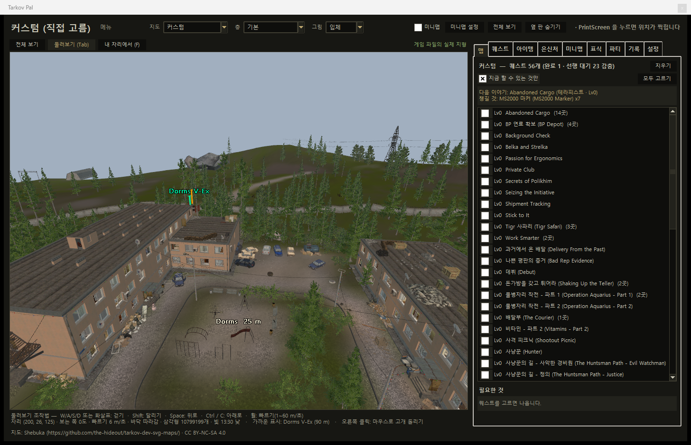 | 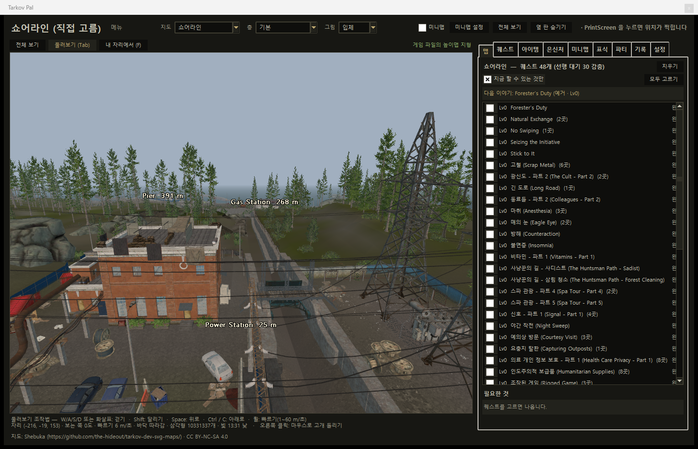 |

### 핑 — 지도에서, 게임 안에서, 게임 화면 위에

- 지도에서 `Alt + 클릭` 핑, `휠 클릭` 경로 점. 파티 전체에 실시간 공유.
- **스마트 핑**: 핑 키(기본 숫자패드 9)를 누르고 스크린샷을 찍으면 **화면 정가운데 시선이 처음 닿는 곳**에 핑이 놓입니다. 문 · 컨테이너 · 탈출구 · 퀘스트 지점이면 무엇인지 글이 붙습니다. 종류별 핑(적 · 소리 · 아이템 · 위험 · 이동).
- **게임 화면 위 핑**: 찍은 핑(파티원 것 포함)이 게임 화면 속 **그 자리에** 거리와 함께 떠 있고, 고개를 돌리면 따라 움직입니다. 시야 밖 · 조준 중 · 인벤토리나 메뉴가 열렸을 때는 숨고, 화면 한가운데 근처는 얇은 고리만 그려 적을 가리지 않습니다. 켜고 끌 수 있습니다.
  - 스크린샷을 찍을 때마다 정확히 맞추고 그 사이는 마우스 움직임으로 따라갑니다. 감도 · 해상도 · 시야각은 게임 설정 파일과 스크린샷으로 알아서 맞춥니다.

### 게임 위 미니맵

- 게임 창 위에 늘 떠 있는 작은 지도. **클릭이 통과**하고 투명도 · 크기 · 위치를 고를 수 있습니다.
- `내 주변만`(1~20배) 또는 맵 전체. `레이드 중에만 띄우기` 를 켜면 메뉴에서는 사라졌다가 레이드가 시작되면 다시 뜹니다.
- 퀘스트 지점 · 탈출구 · 파티원 · 핑 · 경로 · 위험 구역이 같이 나오고, 항목마다 켜고 끌 수 있습니다.

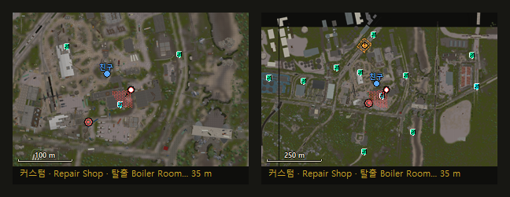

### F1 — 이 창을 게임 위로

- 게임 중 `F1`(바꿀 수 있음)을 누르면 이 프로그램 창이 게임 위로 뜨고, 한 번 더 누르거나 게임을 누르면 치워지면서 게임으로 돌아갑니다. 게임이나 이 프로그램이 맨 앞일 때만 키를 잡습니다.

### 배틀패스 문서 자리

- **375곳(12맵, 쇄빙선 포함)** — Perofunyang 배틀패스 지도의 그림을 게임 지도에 하나하나 맞춰 게임 좌표로 옮겼습니다. 층 평면도에 찍힌 문서도 그 건물 · 그 층에 맞게.
- 다른 층 문서는 흐리게. 누르면 설명과 위치 사진.

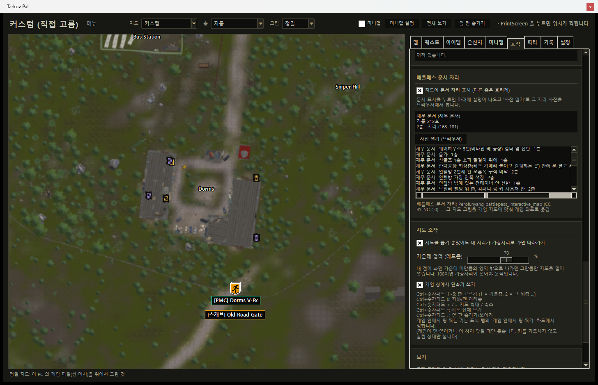

### 퀘스트

- 지금 맵에 걸린 퀘스트만 **한글 (영문)** 으로 보여 주고, 체크하면 지도에 번호가 찍힙니다. 다른 층 지점은 흐리게.
- **게임 로그를 읽어 끝낸 퀘스트는 알아서 빠집니다.** 선행 조건이 안 된 퀘스트는 따로 셉니다.
- 상인별로 "여기까지 했다" 를 한 번 고르면 앞 퀘스트가 전부 완료로 잡힙니다. TarkovTracker 토큰으로 기록 가져오기. PVE 와 PVP 는 따로 셉니다.
- 필요 아이템: 고른 퀘스트에 드는 아이템을 합쳐 보여 주고, 모은 개수를 적으면 남은 수가 바로 바뀝니다.
- **맵을 불러올 때 챙길 것**: 이 맵 퀘스트에 들고 들어가야 하는 아이템(MS2000 마커 등)과 열쇠를 매칭 전에 알려 줍니다.

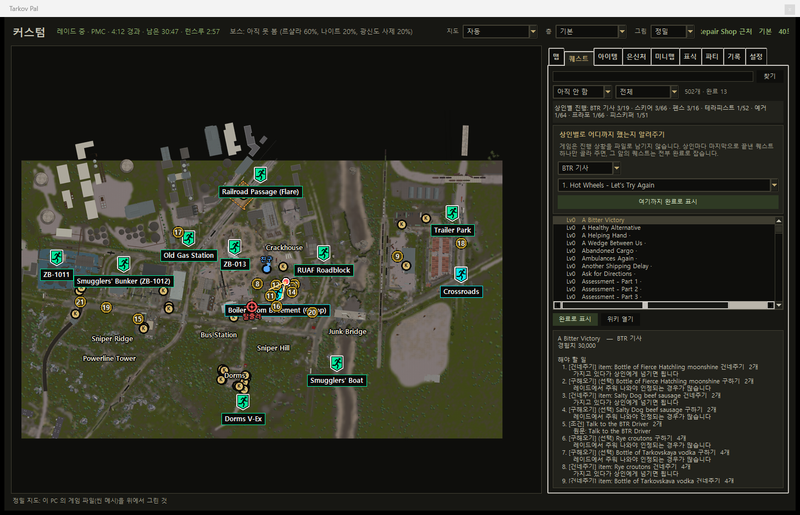

### 지도 정보 (tarkov.dev)

- 켜고 끄는 레이어: 보스 등장 구역과 확률 · 경호 인원 · 체력, PMC / 스캐브 / 저격수 스폰, 열쇠가 필요한 문, 위험 구역, 스위치, 거치 무기, BTR 정류장, 다른 맵 이동 지점, 컨테이너.
- `이 맵에서 찾기`: 아이템 · 보스 · 열쇠 · 컨테이너 이름을 치면 그 자리로 확대.
- 탈출구는 PMC / 스캐브 / 공용 색으로 나누고, 레이드가 시작되면 내 진영 것만 남깁니다.

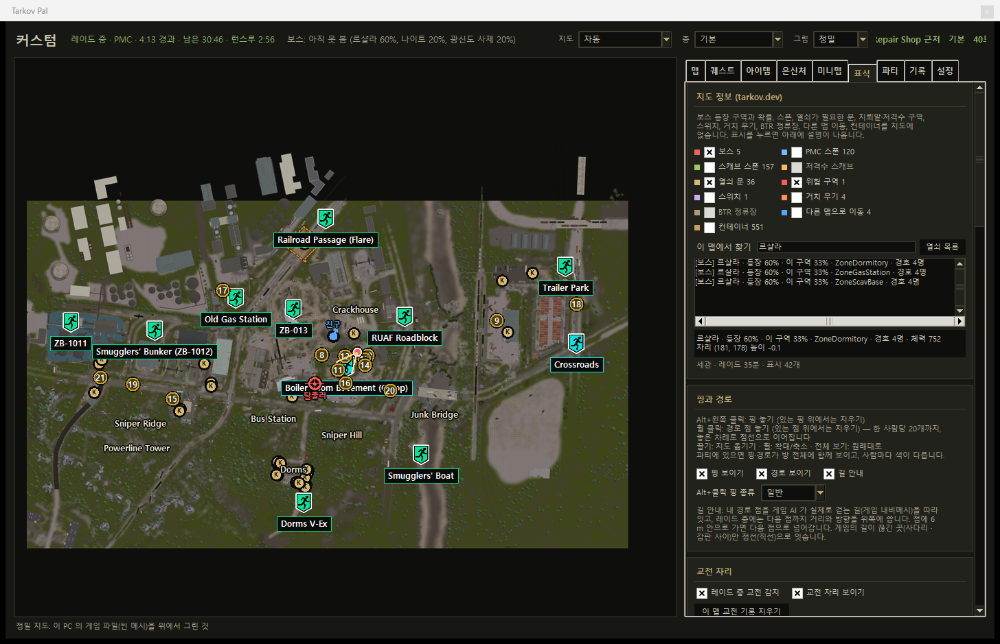

### PVE 로컬 레이드에서 더 알 수 있는 것

PVE 는 봇 · 보스 · 보급품을 내 PC 가 돌리므로 게임 로그에 더 많은 것이 남습니다.

- **보스 스폰 시도 구역**을 판마다 지도에 표시.
- **정확한 레이드 끝 시각**(스캐브 판 포함), 보급품 비행기 · 상자 알림, 판 끝의 핑 · 잃은 패킷.

### 가격 · 탄약 · 교환 · 제작

- 4,800여 개 아이템: 플리마켓 평균 · 최저 · 최고 · 48시간 변동 · 매물 수, 상인 최고 판매가 · 최저 구매가, **수수료 뺀 가장 남는 곳**, 칸당 값. **PVP / PVE 가격 따로**.
- 탄약표: 관통 등급 색, 피해 · 방어구 손상 · 파편 · 탄속 · 정확도 · 반동 · 상인 가격.
- **교환 · 제작**: 교환 855개 · 제작 214개와 수익. 아이템마다 **구하는 법**과 **쓰이는 곳**.

| | |
|---|---|
| 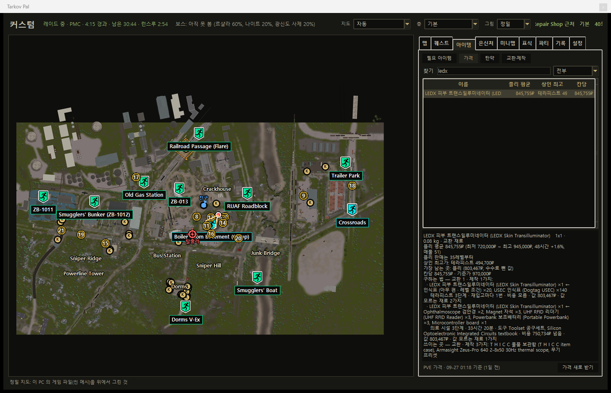 | 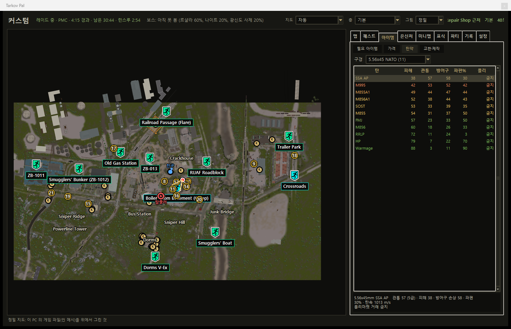 |

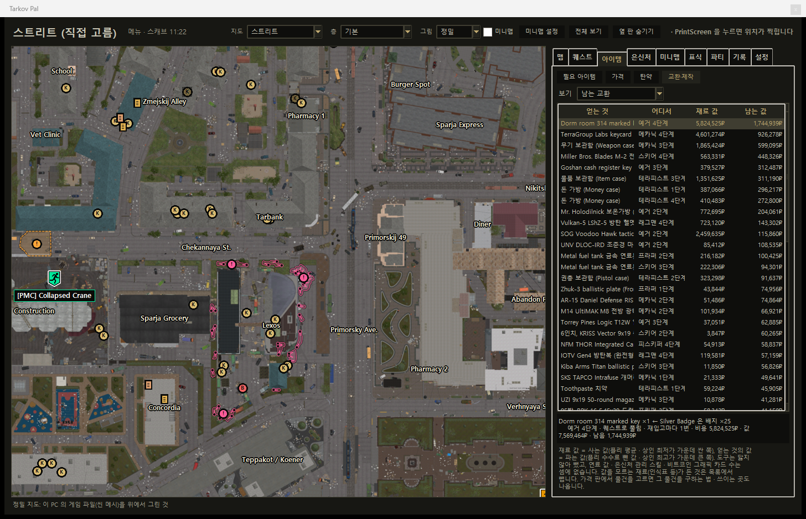

### 은신처

- 제작 타이머: 무엇을 돌렸는지 적어 두면 끝나는 시각을 셉니다.
- 업그레이드 재료 관리: 구역 26개, 지금 단계만 맞춰 두면 다음 단계 재료 · 모은 개수 · 남은 수. `전체 장보기` 로 모든 구역의 다음 단계 재료를 한 번에.

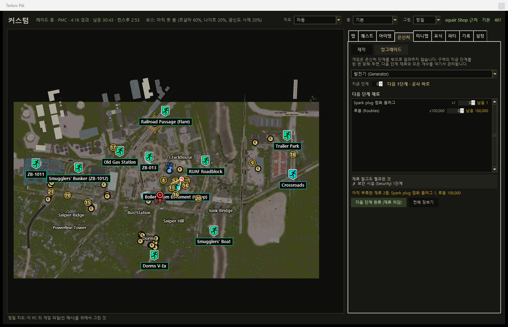

### 기록

- **보험**: 돌아올 때를 셉니다.
- **레이드 기록**: 맵 · 진영 · 시간 · 결과.
- **서버 상태**: 매칭 · 서버 장애 알림.

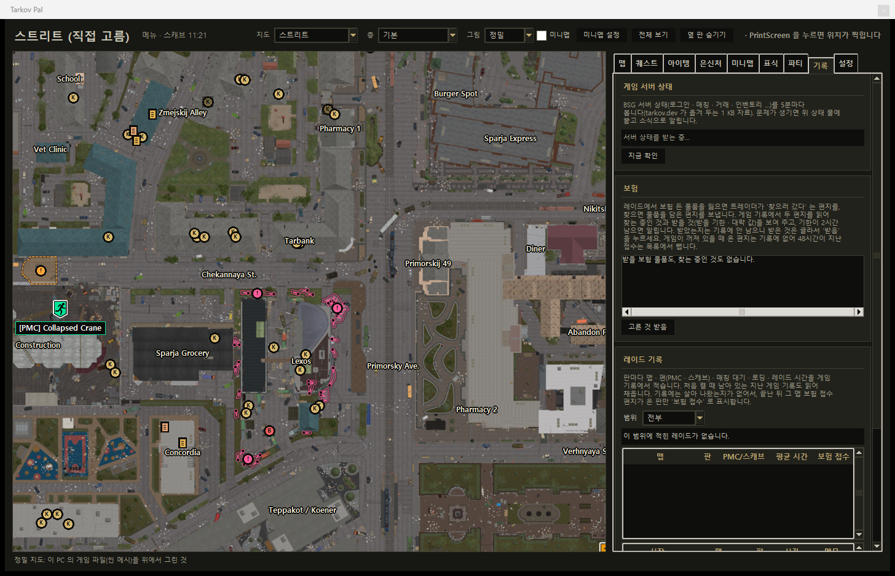

### 파티 — 같이 도는 사람과 위치 공유

- 친구도 이 프로그램을 켜고 한 방에 들어오면 **누가 스크린샷을 찍든 그 자리가 서로의 지도에** 뜹니다. 사람마다 색이 다릅니다.
- `방 만들기` → 초대 코드 하나 → 친구는 붙여 넣고 `들어가기`. 같은 집 · PC방이면 `근처 방 찾기`.
- **공유기 설정이 필요 없습니다.** 직접 연결(UPnP · NAT-PMP 자동)과 중계 서버를 동시에 시도해 먼저 되는 쪽을 씁니다.
- 초대 코드 속 주소는 암호로 잠겨 있어 코드가 새도 IP 를 알 수 없습니다. 중계로 오가는 내용은 끝-끝 암호화.

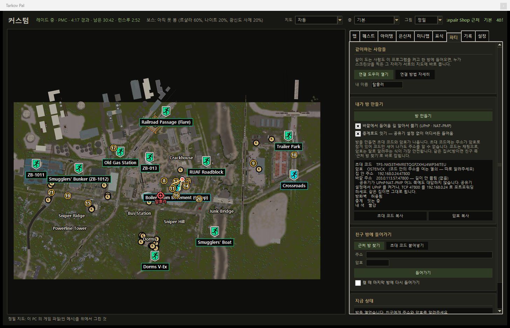

### 시계와 타이머

- **타르코프 게임 시각**(왼쪽 · 오른쪽)과 낮/밤.
- **스캐브 쿨타임**: 펜스 평판과 정보 센터 단계를 넣어 두면 스캐브 레이드가 끝날 때 알아서 세고 준비되면 소리로 알립니다.
- **런스루**: PMC 레이드 중 남은 시간, 기준이 지나면 알림.
- **상인 재입고**(PVP / PVE 따로), **레이드 끝 10 · 5 · 1분 전 소리**, 퀘스트 실패 알림.
- **매칭되면 작업 표시줄의 타르코프가 깜빡** — 다른 창을 보며 기다려도 놓치지 않습니다.

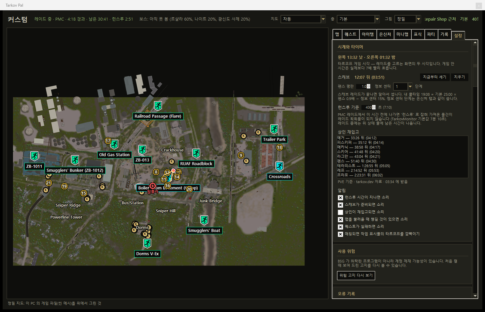

### 멀리 있는 것 두 번 겨눠 찾기

보급품 · 연기 · 저격 자리처럼 멀리 보이는 것의 자리를 찾습니다. **표식 → 두 번 겨누기 시작** 을 누르고, 그것을 화면 가운데에 두고 스크린샷 → 옆으로 30 m 이상 옮겨 다시 스크린샷. 두 시선이 만나는 곳에 핑이 놓이고 오차(보통 ±수 m)도 알려 줍니다.

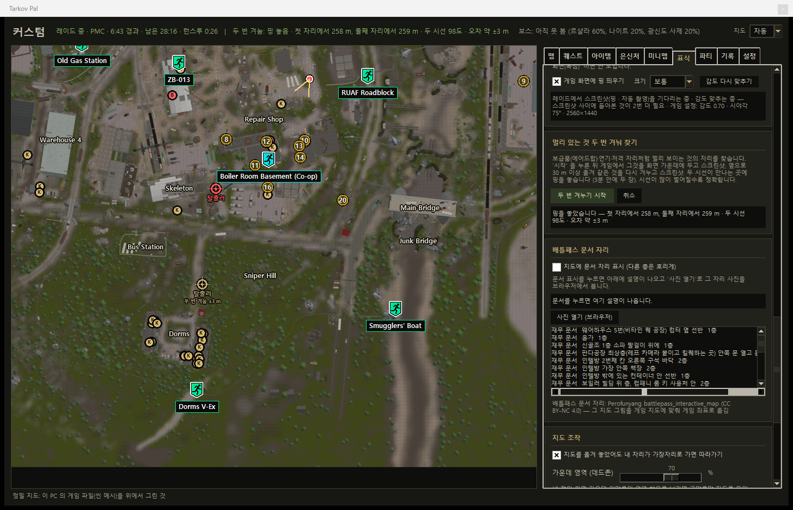

### 입체 미리 만들기

처음 준비 창이 만든 것을 **설정 → 입체 미리 만들기** 에서 다시 만들거나, 게임 업데이트 뒤 바뀐 맵만 채울 수 있습니다. 뒤에서 가장 낮은 우선순위로 만들고 **레이드 중에는 쉬었다가** 끝나면 이어서 합니다.

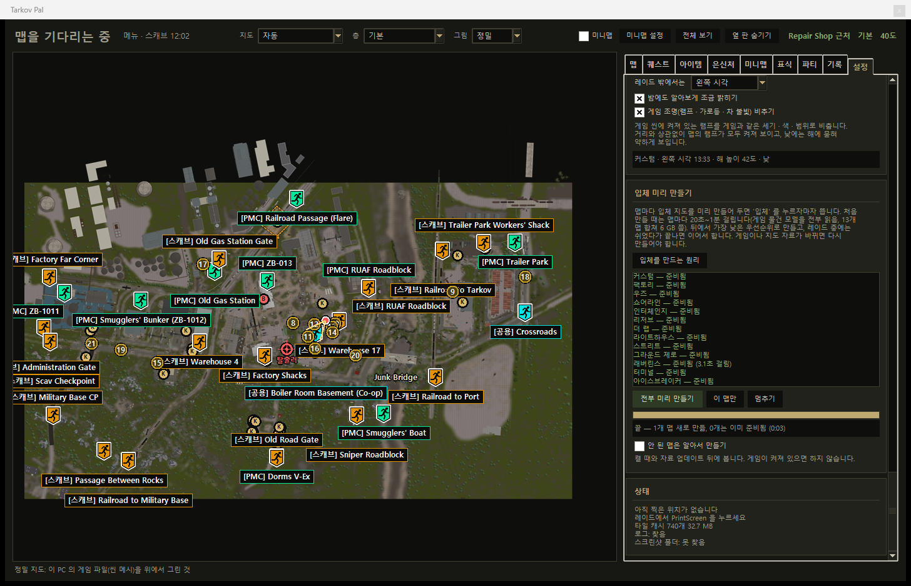

### 그 밖에

- 게임 창에서 `Ctrl + 숫자패드`: 0~5 층, `+` / `-` 확대 · 축소, `*` 전체 보기, `.` 옆 판 숨기기. `F11` 전체 화면.
- 글자 · 아이콘 크기, 옆 판 너비, 어두운 / 밝은 테마.
- **게임에 양보**: 이 창이 앞에 없으면 CPU 우선순위와 전력 사용을 낮춥니다.
- `자료 업데이트` 한 번으로 지도 · 퀘스트 · 가격 등 자료를 새로 받습니다.

## 안전에 대해

- 게임 메모리를 읽지 않고, 게임에 아무것도 끼워 넣지 않습니다. 읽는 것은 스크린샷 파일 이름 · 로그 · 게임 설정 파일 · 설치된 게임 파일(지도 · 3D)뿐입니다.
- 게임 화면 위 핑은 **게임이 맨 앞일 때만** 윈도우의 원시 입력(Raw Input)으로 마우스 움직임을 읽습니다. 게임으로 아무것도 보내지 않습니다.
- 게임에 키 입력을 보내는 기능은 `자동 촬영`(스크린샷 키를 대신 누름) 하나뿐이고, **기본으로 꺼져 있으며** 위험 안내에 동의해야만 켜집니다. PrintScreen 을 직접 누르면 아무 위험이 없습니다.
- 인터넷은 자료 · 가격 · 재입고 시각 · 서버 상태 받기와 파티 연결에만 씁니다. 계정 정보나 스크린샷 자체는 어디에도 보내지 않습니다.
- 처음 켤 때 서드파티 도구 사용 위험 안내가 나오고, 동의해야 쓸 수 있습니다.

## 윈도우 디펜더가 막는다면

파이썬으로 만든 프로그램은 가끔 백신이 기계 학습 추정(`...!ml`)으로 잘못 잡습니다. 이 프로그램은 오탐을 줄이려고 PyInstaller 대신 **자체 실행기 + 폴더판**으로 배포하고, 두 번째 프로세스를 띄우지 않도록 만들었습니다. 배포 파일은 올리기 전에 디펜더로 검사해 위협 없음을 확인합니다. 그래도 잡힌다면 오탐이니 [Microsoft 에 오탐 신고](https://www.microsoft.com/en-us/wdsi/filesubmission)를 해 주시거나, 아래처럼 소스에서 직접 빌드해서 쓰셔도 됩니다.

## 사양

- Windows 10/11 64비트. 압축 65 MB, 풀면 약 97 MB.
- **처음 준비를 마치면 `TarkovPal_자료` 가 약 7 GB 로 늘어납니다**(13개 맵의 3D · 정밀 지도 캐시). 여유 공간을 확인하세요.
- 정밀 지도 · 3D · 위험 구역 · 길 안내는 게임이 깔린 PC 에서 만들어집니다. 그래픽 카드가 셰이더를 못 쓰면 tarkov.dev 지도로 대신합니다. 게임이 없는 PC 에서도 2D 지도 · 퀘스트 · 가격 등은 모두 됩니다.

## 직접 빌드하기

Python 3.14 로 만들었고, 프로그램 자체는 표준 라이브러리(tkinter · ctypes · OpenGL · GDI+ 직접 호출)만 씁니다.

```bash
python build.py
```

`dist/TarkovPal/`(폴더판)과 `dist/TarkovPal_pak.zip` 이 만들어집니다. 소스에서 바로 켜려면 `python tarkov_pal.py`.

시험:

```bash
python -m unittest discover -s tests
```

## 자료 출처 · 고마운 프로젝트

- 지도 타일 · 퀘스트 · 보스 · 스폰 · 열쇠 · 가격 · 교환 · 제작 · 상인 재입고: [tarkov.dev](https://tarkov.dev) (the-hideout)
- 도면 지도: Shebuka, [tarkov-dev-svg-maps](https://github.com/the-hideout/tarkov-dev-svg-maps) (CC BY-NC-SA 4.0)
- 한글 이름 · 퀘스트 조건 · 은신처 자료: SPT 로케일
- 퀘스트 진행 연동: [TarkovTracker](https://tarkovtracker.org)
- 배틀패스 문서 자리: Perofunyang [battlepass_interactive_map](https://github.com/Perofunyang/battlepass_interactive_map) (CC BY-NC 4.0)
- 정밀 지도 · 3D · 위험 구역 · 길 안내: 사용자 PC 에 설치된 게임 파일을 그 자리에서 읽습니다(배포 파일에 게임 파일은 들어 있지 않습니다).
- 기능을 참고한 도구 — 코드를 가져오지 않고 이 프로그램 방식으로 새로 만들었습니다:
  [karpitony/eft-where-am-i](https://github.com/karpitony/eft-where-am-i),
  [the-hideout/TarkovMonitor](https://github.com/the-hideout/TarkovMonitor),
  [RatScanner/RatScanner](https://github.com/RatScanner/RatScanner),
  [adamburgess/tarkov-time](https://github.com/adamburgess/tarkov-time),
  [hymccord/ReadySetTarkov](https://github.com/hymccord/ReadySetTarkov),
  [Re5pawnn/Tarkov_ToolBox](https://github.com/Re5pawnn/Tarkov_ToolBox)

지도 그림과 문서 자리 자료가 비영리(CC BY-NC) 조건이라 이 프로그램도 **무료로만** 배포합니다.

## 알림

Escape from Tarkov 는 Battlestate Games Limited 의 상표입니다. 이 프로젝트는 Battlestate Games 와 관계없는 팬 제작 도구이며, 사용에 따른 책임은 사용자에게 있습니다.

---

### English summary

Tarkov Pal is a free, Korean-language companion app for Escape from Tarkov on Windows. Press PrintScreen in raid and your position (with facing) appears on the map — it only reads the coordinates the game writes into screenshot file names, the game's own log files and your installed game files; no memory reading, no injection. On first launch it builds, from your installed game files, a top-down precise map for every floor of all 13 maps, a 3D map with game textures and game lighting, navmesh-based route guidance, and hazard zones (minefields, sniper zones, claymores) read straight from the game scenes and clipped to the playable area. It also offers an in-game overlay minimap, pings shown on top of the game view, 375 battle-pass document spots, quest tracking from game logs, PVE boss-spawn and airdrop info, flea/trader prices, ammo charts, barters and crafts, hideout planning, insurance / raid history / server status, party position sharing, scav cooldown / runthrough / trader restock timers, and two-sighting triangulation for airdrops.
